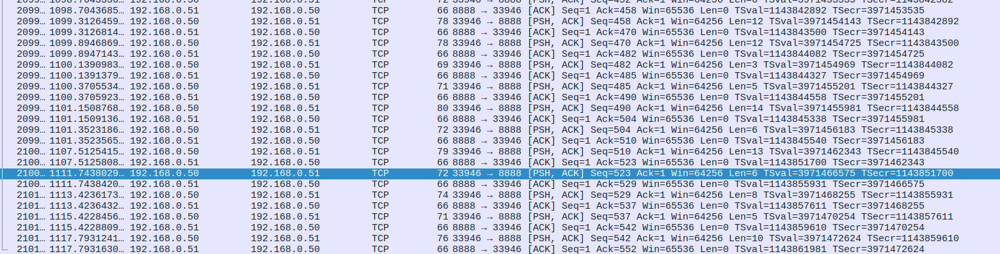
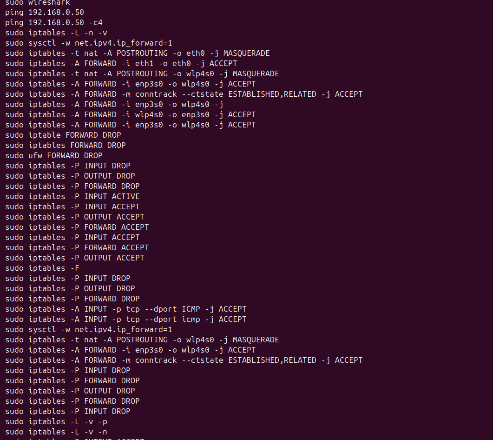

# 🌐 TP – Exploration locale en duo  
## Réseau Ethernet, Gateway, Netcat, Wireshark & Firewall

---

## 📑 Sommaire

- [A. Création d’un réseau local](#a-création-dun-réseau-local)
- [B. Utilisation d’un PC comme Gateway](#b-utilisation-dun-pc-comme-gateway)
- [C. Chat privé avec Netcat](#c-chat-privé-avec-netcat)
- [D. Analyse avec Wireshark et Firewall](#d-analyse-avec-wireshark-et-firewall)

---

# A. Création d’un réseau local

### 1) Configuration des adresses IP

Les deux machines sont configurées manuellement afin d’appartenir au même réseau.

| Machine | Adresse IP     | Masque              | Passerelle      |
|----------|---------------|---------------------|----------------|
| PC1      | 192.168.0.50  | 255.255.252.0 (/22) | 192.168.0.51 |
| PC2      | 192.168.0.51  | 255.255.252.0 (/22) | — |


---

### 2) Test de connectivité locale

```bash
ping 192.168.0.50 -c 4
```


Résultat :

```
0% packet loss
```

La communication Ethernet directe est fonctionnelle.

---

### 3) Test d’accès Internet

```bash
ping google.fr -c 4
```


Les réponses sont reçues → accès Internet opérationnel.

---

### 4) Observations

- **Pourquoi le ping fonctionne‑t‑il ?**  
  Les deux machines ont des adresses dans le même réseau logique.

- **Et si le masque change ?**  
  Les machines ne se reconnaissent plus comme appartenant au même réseau → échec du ping.

---

# B. Utilisation d’un PC comme Gateway

### 1) Désactivation du WiFi


Après coup, le PC1 perd l’accès Internet (pas de capture d’erreur disponible).

---

### 2) Activation du routage IP

```bash
sudo sysctl -w net.ipv4.ip_forward=1
```


`ip_forward` permet au PC2 de router les paquets entre ses deux interfaces.

---

### 3) Mise en place du NAT (MASQUERADE)

```bash
sudo iptables -t nat -A POSTROUTING -o wlp4s0 -j MASQUERADE
sudo iptables -A FORWARD -i enp3s0 -o wlp4s0 -j ACCEPT
sudo iptables -A FORWARD -m conntrack --ctstate ESTABLISHED,RELATED -j ACCEPT
```


Le NAT masque les adresses privées du PC1 derrière l’IP publique du PC2.

---

### 4) Test final via la passerelle

```bash
ping 8.8.8.8
```

✔ Internet fonctionne via la gateway.

---

### 5) Analyse

- **Rôle du NAT ?** Traduction d’adresses privées en adresse publique.
- **Pourquoi activer `ip_forward` ?** Sans cela, PC2 n’achemine pas les paquets.

---

# C. Chat privé avec Netcat

### 1) Mise en écoute (serveur)

```bash
nc -l -p 8888
```


---

### 2) Connexion client

```bash
nc 192.168.0.51 8888
```

---

### 3) Échanges

```
salut
bonjour
message
```


Communication bidirectionnelle établie.

---

### 4) Analyse

- Protocole utilisé : **TCP**
- Rôle du port : identifie le service (8888 ici).

---

# D. Analyse avec Wireshark et Firewall

### 1) Installation de Wireshark

```bash
sudo apt install wireshark
sudo usermod -aG wireshark administrateur
```


---

### 2) Capture ICMP (Ping)

Filtre :

```
icmp
```


Observations : Type 8 echo request, Type 0 echo reply.

---

### 3) Capture TCP (Netcat)

Filtre :

```
tcp.port == 8888
```



On y voit le handshake SYN / SYN‑ACK / ACK et des segments PSH,ACK.

---

### 4) Activation d’un firewall restrictif

```bash
sudo iptables -P INPUT DROP
sudo iptables -P OUTPUT DROP
sudo iptables -P FORWARD DROP
```


---

### 5) Autorisation ICMP

```bash
sudo iptables -A INPUT -p tcp --dport ICMP -j ACCEPT
```



---

### 6) Autorisation du port 8888

```bash
sudo iptables -A INPUT -p tcp --dport 8888 -j ACCEPT
sudo iptables -A OUTPUT -p tcp --sport 8888 -j ACCEPT
```


---

### 7) Vérification des règles

```bash
sudo iptables -L -n -v
```


---

### 8) Questions

- Le ping ne passe plus avec une politique DROP par défaut.
- INPUT **et** OUTPUT doivent être autorisés pour le trafic bidirectionnel.
- Wireshark montre les trois étapes du handshake TCP.

---

# Conclusion

Ce TP a permis de :

- configurer un réseau local
- mettre en œuvre une passerelle NAT
- dialoguer avec Netcat
- capturer et analyser ICMP/TCP
- créer des règles firewall avec iptables

---

## ✔ Résultats obtenus

- Communication locale validée  
- Accès Internet via gateway opérationnel  
- Captures ICMP/TCP exploitées  
- Firewall configuré correctement  

