# 🌐 TP – Exploration locale en duo  
## Réseau Ethernet, Gateway, Netcat, Wireshark & Firewall

---

## 📑 Sommaire

- [A. Création d’un réseau local](#a-création-dun-réseau-local)
- [B. Utilisation d’un PC comme Gateway](#b-utilisation-dun-pc-comme-gateway)
- [C. Chat privé avec Netcat](#c-chat-privé-avec-netcat)
- [D. Analyse avec Wireshark et Firewall](#d-analyse-avec-wireshark-et-firewall)

---

# A. Création d’un réseau local

## 1) Configuration des adresses IP

Les deux machines sont configurées manuellement afin d’appartenir au même réseau.

| Machine | Adresse IP     | Masque              | Passerelle      |
|----------|---------------|---------------------|----------------|
| PC1      | 192.168.0.50  | 255.255.252.0 (/22) | 192.168.0.51 |
| PC2      | 192.168.0.51  | 255.255.252.0 (/22) | — |

---

## 2) Test de connectivité locale

```bash
ping 192.168.0.50 -c 4
```

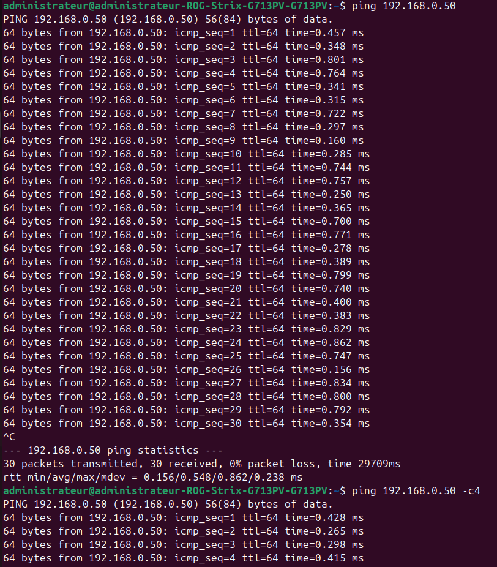

Résultat :

```
0% packet loss
```

La communication Ethernet directe est fonctionnelle.

---

## 3) Test d’accès Internet

```bash
ping google.fr -c 4
```


Les réponses sont reçues → accès Internet opérationnel.

---

## 4) Observations

### Pourquoi le ping fonctionne-t-il ?

Les deux machines sont dans le même réseau logique (même masque).

### Que se passe-t-il si le masque change ?

Si les masques ne correspondent pas, les machines ne se reconnaissent plus comme appartenant au même réseau → échec du ping.

---

# B. Utilisation d’un PC comme Gateway

## 1) Désactivation du WiFi


Le PC1 ne possède plus d’accès Internet direct.

---

## 2) Activation du routage IP

```bash
sudo sysctl -w net.ipv4.ip_forward=1
```

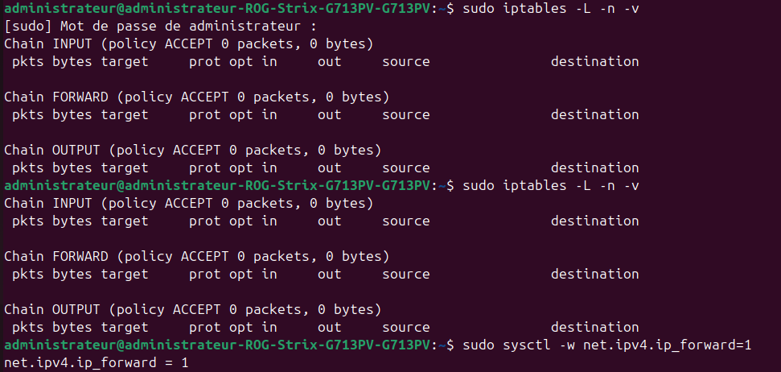

L’option `ip_forward` permet au PC2 de router les paquets entre ses interfaces.

---

## 3) Mise en place du NAT (MASQUERADE)

```bash
sudo iptables -t nat -A POSTROUTING -o wlp4s0 -j MASQUERADE
sudo iptables -A FORWARD -i enp3s0 -o wlp4s0 -j ACCEPT
sudo iptables -A FORWARD -m conntrack --ctstate ESTABLISHED,RELATED -j ACCEPT
```

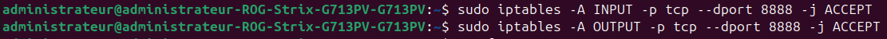

Le NAT permet au trafic du PC1 d’être masqué derrière l’adresse IP du PC2.

---

## 4) Test final via la passerelle

```bash
ping 8.8.8.8
```

✔ Internet fonctionne via la gateway.

---

## 5) Analyse

### Quel est le rôle du NAT ?

Il traduit les adresses privées en adresse publique afin de permettre la communication avec Internet.

### Pourquoi activer `ip_forward` ?

Sans cela, le PC2 ne transfère pas les paquets entre ses interfaces réseau.

---

# C. Chat privé avec Netcat

## 1) Mise en écoute (Serveur)

```bash
nc -l -p 8888
```

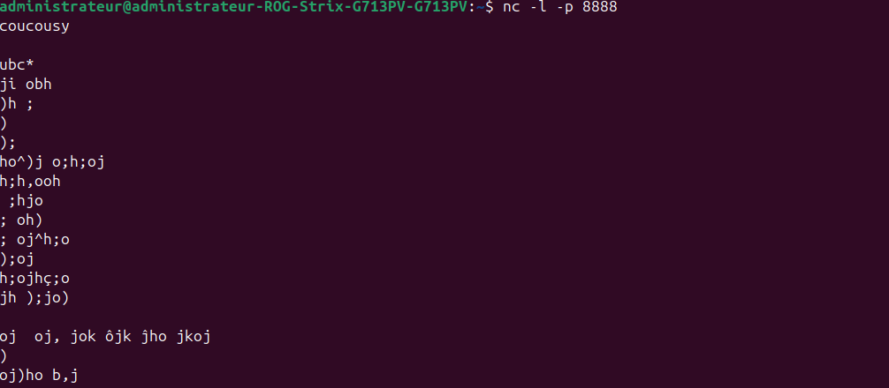

---

## 2) Connexion client

```bash
nc 192.168.0.51 8888
```
---

## 3) Échanges

```
salut
bonjour
message
```

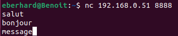

Communication bidirectionnelle établie avec succès.

---

## 4) Analyse

### Quel protocole est utilisé ?

Netcat utilise le protocole **TCP**.

### Pourquoi utiliser un port spécifique ?

Un port identifie un service.  
Ici, le port 8888 correspond à notre serveur Netcat.

---

# D. Analyse avec Wireshark et Firewall

## 1) Installation de Wireshark

```bash
sudo apt install wireshark
sudo usermod -aG wireshark administrateur
```

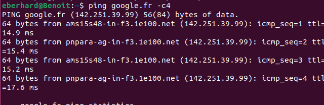

---

## 2) Capture ICMP (Ping)

Filtre :

```
icmp
```

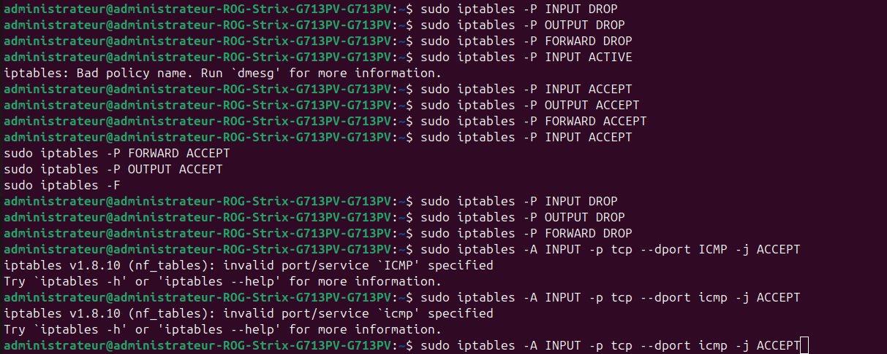

Observation :

- ICMP Type 8 → Echo Request  
- ICMP Type 0 → Echo Reply  

---

## 3) Capture TCP (Netcat)

Filtre :

```
tcp.port == 8888
```

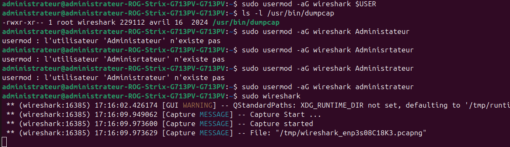

Observation :

- Handshake TCP (SYN / SYN-ACK / ACK)  
- Segments PSH, ACK  

---

## 4) Activation d’un Firewall restrictif

```bash
sudo iptables -P INPUT DROP
sudo iptables -P OUTPUT DROP
sudo iptables -P FORWARD DROP
```


---

## 5) Autorisation ICMP

```bash
sudo iptables -A INPUT -p icmp -j ACCEPT
sudo iptables -A OUTPUT -p icmp -j ACCEPT
```

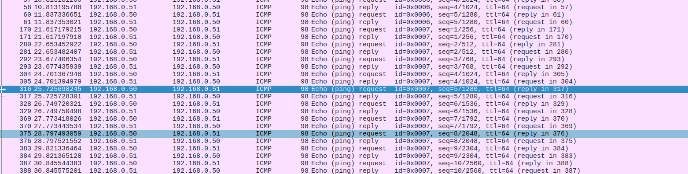

---

## 6) Autorisation du port 8888

```bash
sudo iptables -A INPUT -p tcp --dport 8888 -j ACCEPT
sudo iptables -A OUTPUT -p tcp --sport 8888 -j ACCEPT
```

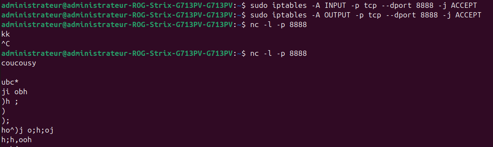

---

## 7) Vérification des règles

```bash
sudo iptables -L -n -v
```

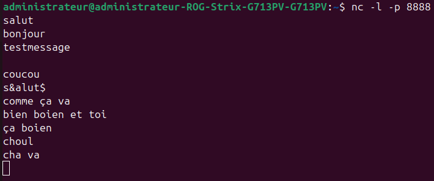

---

## 8) Questions

### Pourquoi le ping ne fonctionne-t-il plus avec une politique DROP ?

Car tout le trafic est bloqué par défaut.

### Pourquoi faut-il autoriser à la fois INPUT et OUTPUT ?

Le ping et TCP nécessitent des paquets dans les deux sens.

### Que montre Wireshark lors d’un handshake TCP ?

Trois étapes : SYN → SYN-ACK → ACK.

---

# Conclusion

Ce TP a permis de mettre en pratique :

- La configuration d’un réseau local
- L’utilisation d’un PC comme passerelle
- Le fonctionnement du NAT
- La communication TCP avec Netcat
- L’analyse des trames ICMP et TCP
- La configuration d’un firewall avec iptables

---

## ✔ Résultats obtenus

- Communication locale validée  
- Accès Internet via gateway opérationnel  
- Capture ICMP et TCP analysée  
- Firewall configuré correctement  
