# 1. Affichage d’informations sur la pile TCP/IP locale

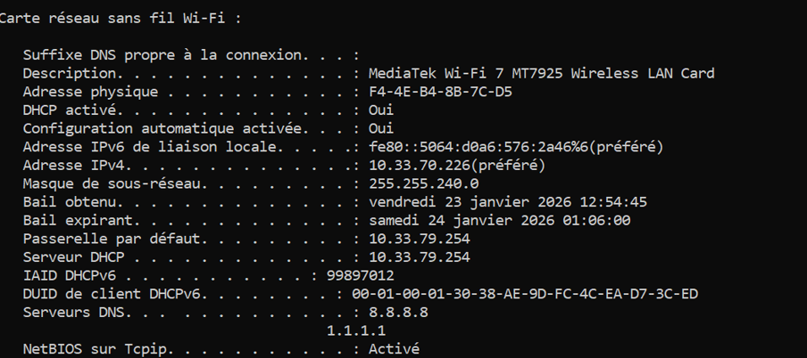

Masque /20 → 4096 adresses par réseau.

## Interface Wi-Fi

Adresse IP :  
10.33.70.226  

Adresse MAC :  
F4-4E-B4-8B-7C-D5  

Adresse de réseau :  
10.33.64.0  

Adresse de broadcast :  
10.33.79.255  

Plage d’adresses utilisables :  
10.33.64.1 à 10.33.79.254  

Gateway (passerelle) :  
Passerelle par défaut : 10.33.79.254  

La gateway permet de sortir du réseau local d’Ingésup afin d’accéder à d’autres réseaux, notamment Internet.  
Sans gateway, la communication serait limitée au réseau local.

---

## Interface Ethernet

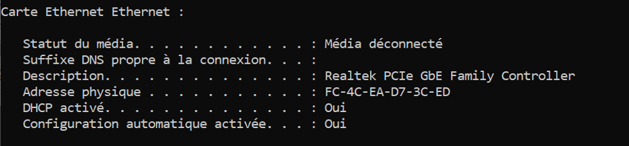

Interface Ethernet :  
DOWN (Déconnecté donc aucune adresse attribuée)

---

## Scan du réseau Wi-Fi avec nmap

J’ai utilisé l’outil **nmap** pour scanner le réseau Wi-Fi Ingésup.  
Le réseau étant `10.33.64.0/20`, la commande utilisée est :

nmap -sn -PE 10.33.64.0/20

Cette commande permet d’identifier les hôtes actuellement actifs sur le réseau.  
Une adresse libre au moment de la commande :  
Exemple : `10.33.79.223`

Les adresses IP non listées peuvent être considérées comme potentiellement libres.

J’ai également testé la commande **nmap -sL**, qui liste les hôtes connus du réseau, même s’ils sont déconnectés.

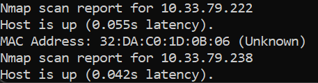

---

## Modification manuelle de l’adresse IP

Paramètres → Réseau et Internet → Wi-Fi → Propriétés matérielles → IPv4

Ici on applique une IP disponible sur le réseau.

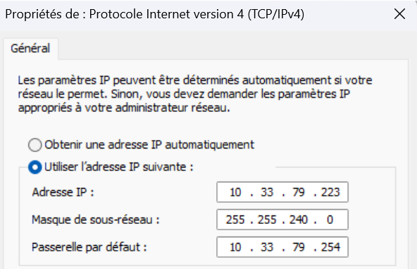

Si on change la passerelle par défaut, nous n’avons plus accès à Internet.

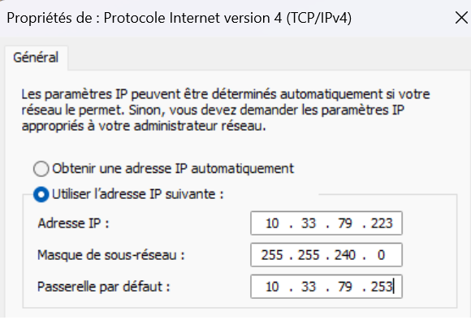

---

# III. DHCP

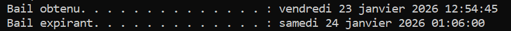

Serveur DHCP :  
10.33.79.254  

Bail obtenu :  
vendredi 23 janvier 2026 à 12:54:45  

Bail expirant :  
samedi 24 janvier 2026 à 01:06:00  

Lorsqu’un PC se connecte à un réseau, il demande une adresse IP.  
Le serveur DHCP lui en propose une.  
Le PC l’accepte.  
Le serveur DHCP valide et attribue un bail pour une durée limitée.

Ce mécanisme permet :
- d’éviter les conflits d’adresses IP
- de simplifier la configuration réseau

ipconfig /release
ipconfig /renew

# 2. DNS

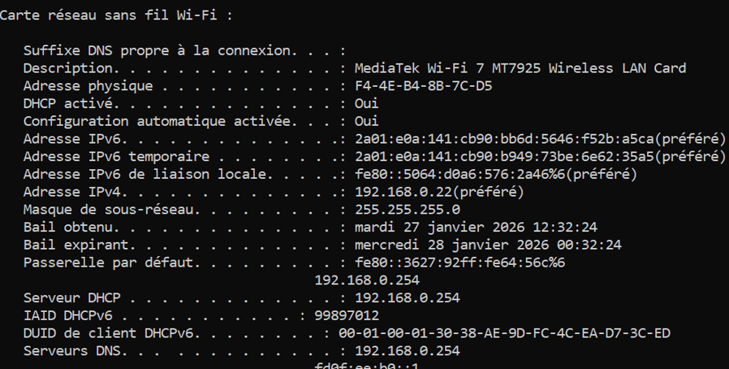

Adresse IPv4 :
192.168.0.22

Serveur DNS IPv4 :
192.168.0.254

Serveur DNS IPv6 :
fd0f:ee:b0::1

nslookup google.com

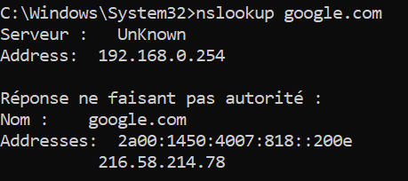

Le nom de domaine google.com est associé à plusieurs adresses IP.

nslookup ynov.com

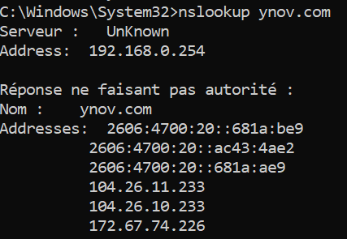

Le nom de domaine ynov.com est associé à plusieurs adresses IP.

nslookup 78.78.21.21

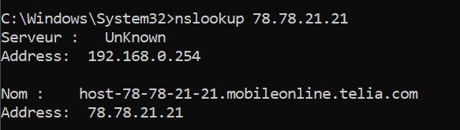

Le nom de domaine 78.78.21.21 est associé à plusieurs adresses IP.

nslookup 92.16.54.88

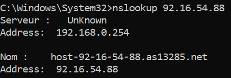

Cette adresse IP possède également une entrée DNS.