# 🔐 TP3 – Cryptographie avec OpenSSL

---

## 📑 Sommaire

- [A. Base64](#a-base64)
- [B. Chiffrement symétrique — AES](#b-chiffrement-symétrique--aes)
- [C. Cryptographie asymétrique – RSA](#c-cryptographie-asymétrique--rsa)
- [D. Signature numérique](#d-signature-numérique)

---

# A. Base64

## 1) Génération d’un fichier binaire (100 Ko)

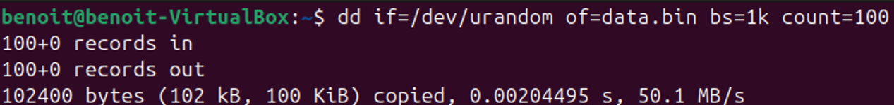

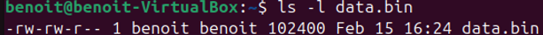

---

## 2) Encodage

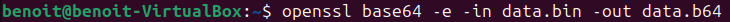

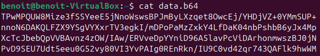

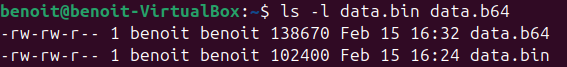

`data.b64` est plus gros que `data.bin`, d’environ **33 %**.

---

## 3) Décodage

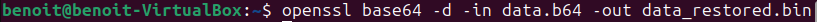

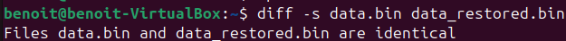

---

## 4) Questions

### Base64 est-il un chiffrement ? Pourquoi ?

Non, Base64 est un **encodage** : il n’y a pas de clé, tout le monde peut décoder.

### Pourquoi la taille change ?

Base64 convertit des octets binaires en caractères texte :  
3 octets deviennent 4 caractères.

### Pourcentage d’augmentation approximatif ?

Environ **+33 %**.

### Méthode rigoureuse pour vérifier l’identité ?

```bash
diff -s data.bin data_restored.bin
```

---

## B. Chiffrement symétrique — AES

### 1) Créer `confidentiel.txt`

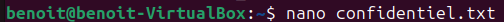

---

### 2) Chiffrement (AES-256 + sel + PBKDF2 + SHA-256)

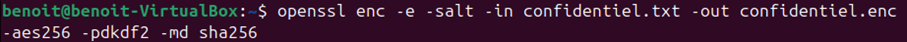

#### Vérifier que le fichier est binaire

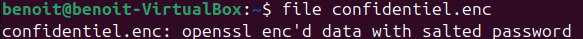

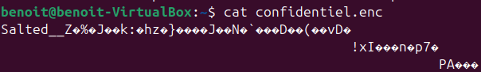

---

### 3) Déchiffrement vers `confidentiel_dechiffre.txt`

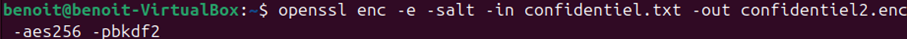

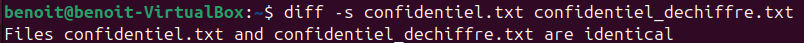

---

### 4) Analyse : chiffrer une seconde fois et comparer

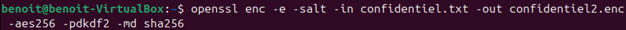

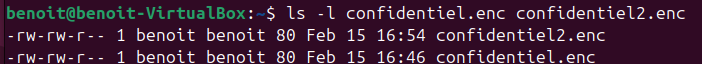

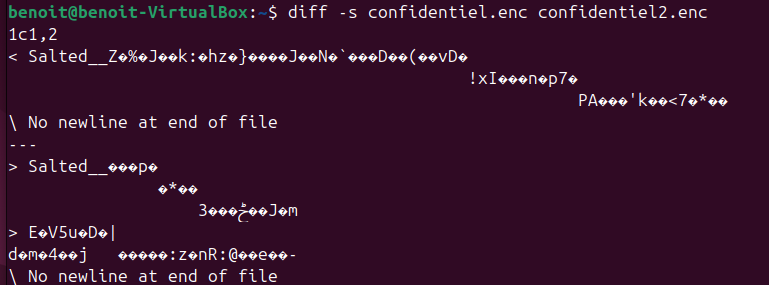

---

### 5) Questions

#### Pourquoi les deux fichiers chiffrés sont-ils différents ?

À cause du **sel** (et des valeurs aléatoires associées) :  
même fichier + même mot de passe → sortie différente.

---

#### Quel est le rôle du sel ?

Rendre le chiffrement unique et empêcher les attaques pré-calculées  

---

#### Si une option change au déchiffrement ?

Échec ou résultat illisible :  
il faut exactement les mêmes paramètres qu’au chiffrement.

---

#### Pourquoi PBKDF2 ?

Pour rendre la clé plus difficile à deviner à partir du mot de passe et ralentir les attaques par brute force sur le mot de passe.

---

#### Différence entre encodage et chiffrement ?

Encodage = change le format
Chiffrement = protège avec une clé / mot de passe.

---

## C. Cryptographie asymétrique – RSA

### 1) Génération de clés

#### Clé privée 2048 bits

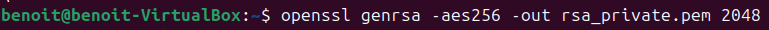

#### Clé publique

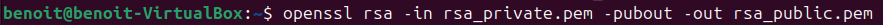

#### Protéger la clé privée par un chiffrement

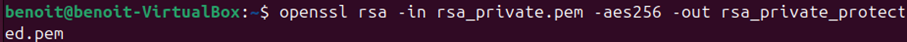

---

### Afficher les paramètres détaillés

#### Clé privée

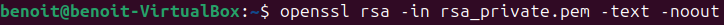
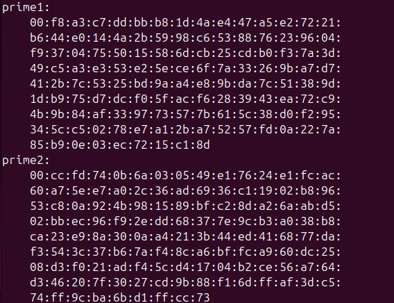

#### Clé publique

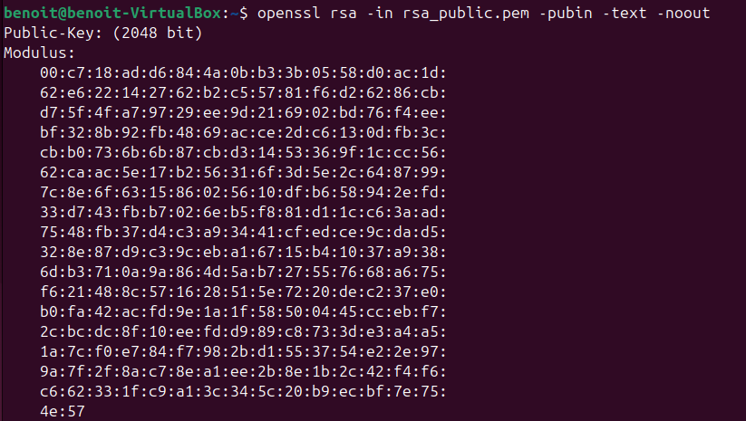

---

### Comparaison

Clé publique : `modulus (n)` + `publicExponent (e)`  
Clé privée : `privateExponent (d)` + `prime1` + `prime2` + autres paramètres

---

### 2) Chiffrement asymétrique

#### Créer `secret.txt`

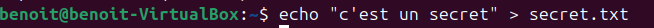

#### Chiffrer avec la clé publique → `secret.enc`

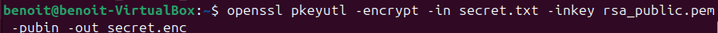

#### Déchiffrer avec la clé privée

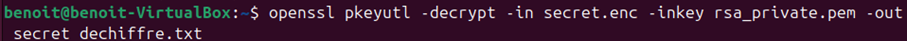

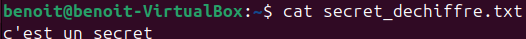

---

### 3) Questions

#### Pourquoi la clé privée ne doit-elle jamais être partagée ?

Elle permet de **déchiffrer et signer** :  
si elle fuite, tout est compromis.

---

#### Pourquoi RSA n’est pas adapté aux gros fichiers ?

C’est lent et limité :  
on chiffre plutôt une petite donnée (clé) que tout le fichier.

---

#### Différences clé publique / clé privée ?

Publique : `n`, `e`  
Privée : `n`, `e`, `d`, `prime1`, `prime2`…

---

#### Rôle du modulo (n) ?

Base mathématique de RSA  
(produit de deux grands nombres premiers).

---

#### Pourquoi chiffrer une clé AES avec RSA ?

RSA pour échanger une petite clé.  
AES pour chiffrer un gros volume.  
→ **chiffrement hybride**.

---

## D. Signature numérique

### 1) Création et signature

#### Créer `contrat.txt`

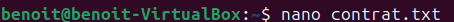

#### Empreinte (hash)

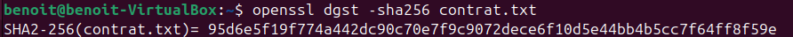

#### Signer avec la clé privée → `contrat.sig`

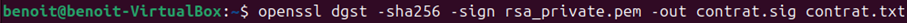

---

### 2) Vérification

#### Vérifier avec la clé publique

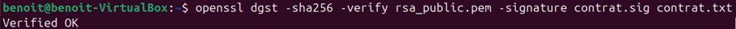

#### Modifier légèrement le fichier

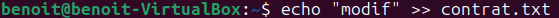

#### Refaire la vérification

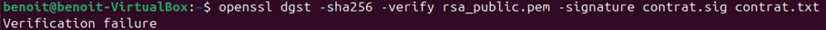

---

### 3) Questions

#### Après modification, que se passe-t-il ?

La signature devient **invalide**.

---

#### Pourquoi ?

Le hash change, donc la signature ne correspond plus.

---

#### Rôle du hachage dans la signature ?

On signe une **empreinte (taille fixe)**, pas le fichier entier  
→ intégrité + efficacité.

---

#### Signature numérique vs chiffrement ?

Signature = intégrité + authenticité  
Chiffrement = confidentialité