# 🔐 TP4 – Administration SSH & Serveur Web Nginx (adapté au nouveau sujet)

Ce document suit précisément le sujet mis à jour dans `subject.md`. Les
captures proviennent de `imageTP4` et sont placées là où elles apportent une
illustration utile.

---

## 1. Mise en place de l’environnement virtualisé

- Installer VirtualBox sur l’hôte :

```bash
sudo apt update
sudo apt install virtualbox
virtualbox --help
```

- Créer une VM Ubuntu « Serveur-SSH » : 2 Go RAM, 20 Go disque, réseau en
  **Bridged Adapter**.

Vérifier l’adresse IP dans la VM et ping depuis l’hôte :

```bash
ip a
ping <IP_VM>
```

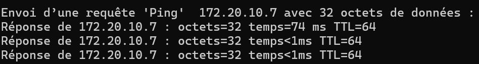

---

## 2. Installation et configuration du serveur SSH

```bash
sudo apt update
sudo apt install openssh-server
```

Vérifier que le service tourne :

```bash
sudo systemctl status ssh
sudo ss -tlnp | grep ssh
```

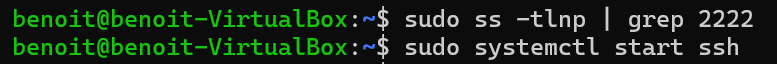  <!-- démarrage et vérification -->

---

## 3. Première connexion SSH

```bash
ssh etudiant@<IP_VM>
```

Accepter l’empreinte et saisir le mot de passe. La clé du serveur est ajoutée à
`~/.ssh/known_hosts`.

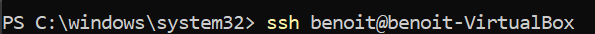

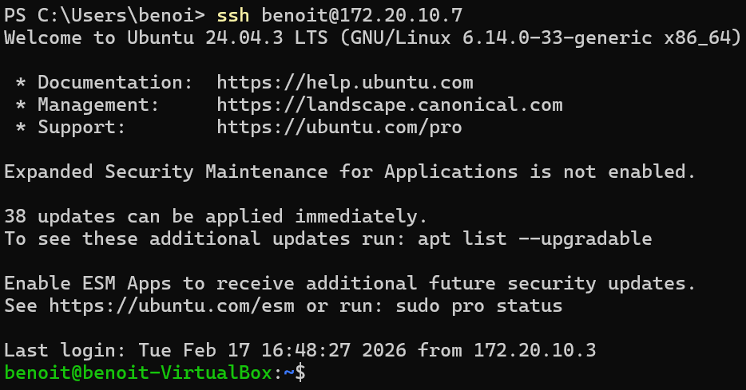

---

## 4. Authentification par clé

### 4.1 Génération de clé

```bash
ssh-keygen -t ed25519
```


### 4.2 Copier la clé vers le serveur

```bash
ssh-copy-id etudiant@<IP_VM>
```


### 4.3 Test

```bash
ssh etudiant@<IP_VM>
```


---

## 5. Sécurisation du serveur

Modifier `/etc/ssh/sshd_config` : désactiver mot de passe et root, changer le
port.

```
PasswordAuthentication no
PermitRootLogin no
Port 2222
```

Redémarrer SSH :

```bash
sudo systemctl restart ssh
```

Vérifier l’écoute sur le port 2222 :

```bash
sudo ss -tlnp | grep 2222
```


Tester la connexion sur le nouveau port (échec avant modification illustré :)

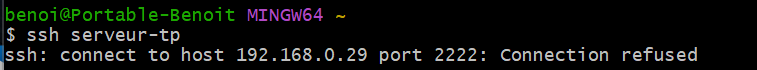

---

## 6. Configuration d’un alias SSH

Ajouter dans `~/.ssh/config` :

```
Host serveur-tp
    HostName <IP_VM>
    User etudiant
    Port 2222
```

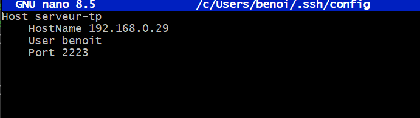

Connexion simplifiée :

```bash
ssh serveur-tp
```

---

## 7. Transfert de fichiers

### 7.1 SCP

```bash
scp fichier.txt serveur-tp:/home/etudiant/
scp -r dossier/ serveur-tp:/home/etudiant/
```

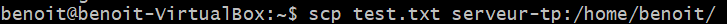

Après création du fichier de test et transfert on peut vérifier son contenu :

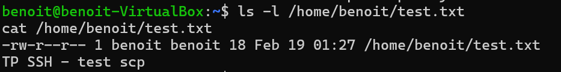

### 7.2 SFTP

```bash
sftp serveur-tp
> put fichier.txt
> get fichier.txt
> ls
> exit
```

### 7.3 RSYNC

```bash
rsync -avz dossier/ serveur-tp:/home/etudiant/dossier/
```

---

## 8. Analyse des logs

```bash
sudo tail -f /var/log/auth.log
```

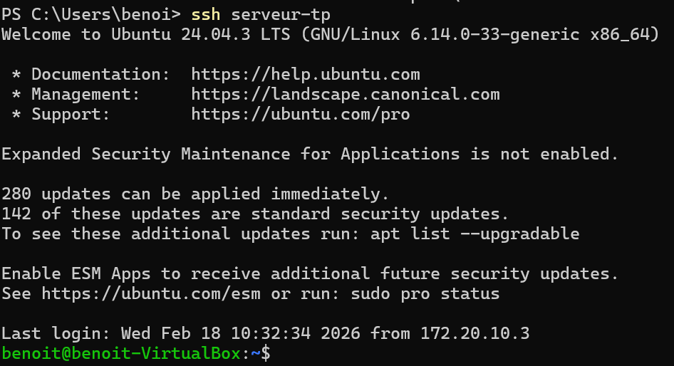

Observer connexions réussies, échecs de mot de passe, tentatives sur le
mauvais port, etc.

---

## 9. Installation et analyse de Fail2Ban

```bash
sudo apt install fail2ban
sudo systemctl status fail2ban
sudo fail2ban-client status sshd
```

Configurer `/etc/fail2ban/jail.local` : (exemple ci‑dessous, port 2222)

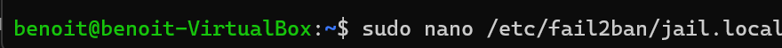

```
[sshd]
enabled = true
port = 2222
backend = systemd
maxretry = 3
findtime = 60
bantime = 60
```

Redémarrer :

```bash
sudo systemctl restart fail2ban
```


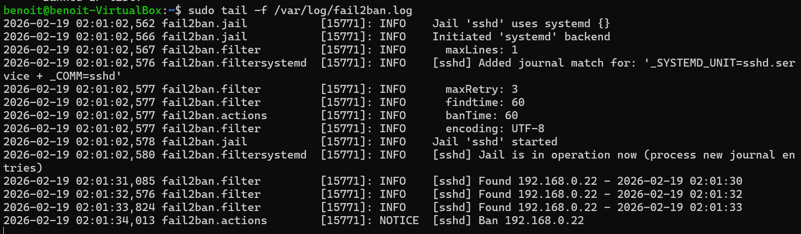

---

## 10. Tunnel SSH

### 10.1 Tunnel local

```bash
ssh -L 8080:localhost:80 serveur-tp
```

Permet d’accéder à un service HTTP distant via `http://localhost:8080`.

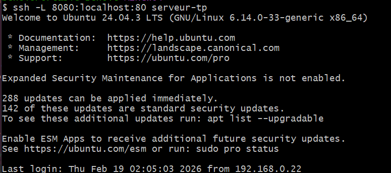

Résultat affiché par curl :

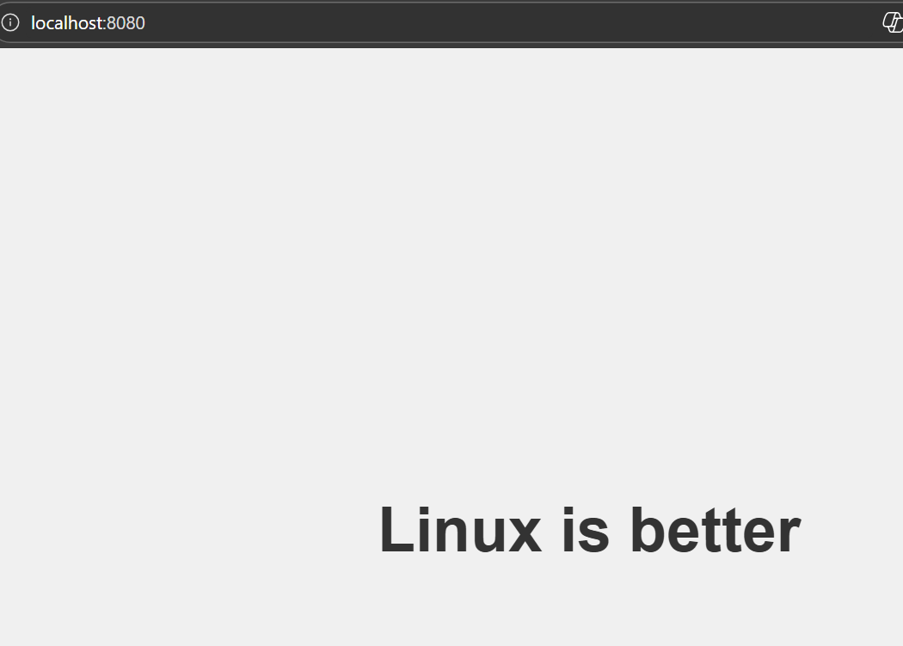

### 10.2 Tunnel distant

```bash
ssh -R 9090:localhost:22 serveur-tp
```

Sur le serveur, `curl http://localhost:9090` renvoie la page du client :

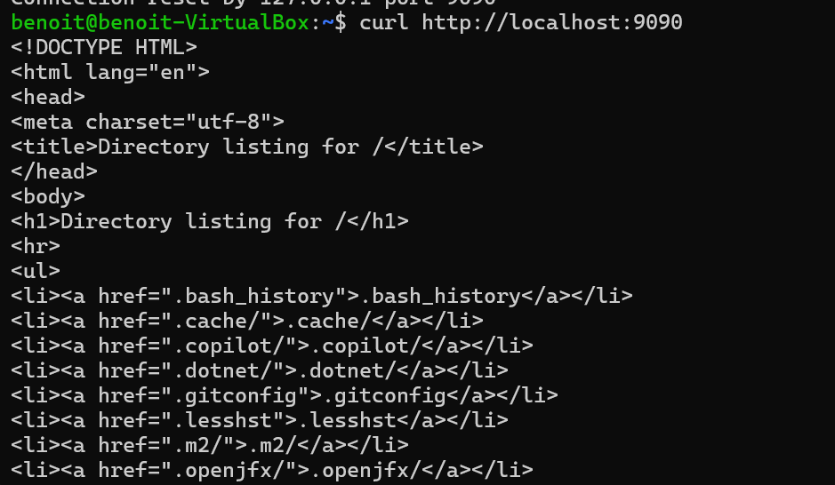

---

## 11. Simulation d’incidents et diagnostic

- Arrêter SSH : (non illustré).
- Mauvais port – voir image 37 connexion refusée.
- Mauvaise IP – pas d’image.
- Permissions incorrectes – pas d’image.
- Vérifier réseau, service, port (`ss`), logs, configuration, tests locaux.

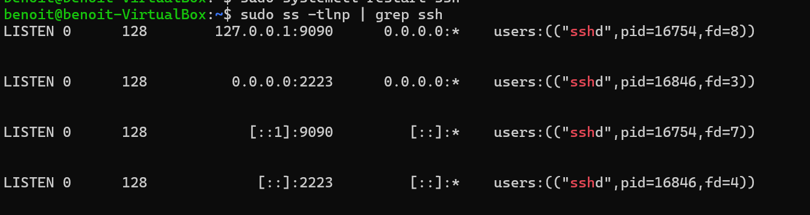

---

## 12. Résultat attendu

- Serveur SSH fonctionnel
- Authentification par clé uniquement
- Mot de passe désactivé
- Root interdit
- Port modifié
- Tunnel SSH fonctionnel
- Transferts opérationnels
- Fail2Ban actif
- Analyse logs maîtrisée

---

## 13. Installation et configuration Nginx

```bash
sudo apt update
sudo apt install nginx
sudo systemctl status nginx
```


Créer la page test :

```bash
sudo mkdir -p /var/www/site-tp
echo '<h1>Bienvenue sur le site TP Nginx !</h1>' \
    | sudo tee /var/www/site-tp/index.html
```

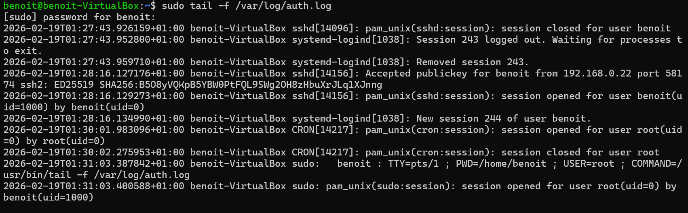

Configurer le site :

```bash
sudo vim /etc/nginx/sites-available/site-tp
```

```nginx
server {
    listen 80;
    server_name localhost;
    root /var/www/site-tp;
    index index.html;
}
```

Activer, tester et redémarrer :

```bash
sudo ln -s /etc/nginx/sites-available/site-tp /etc/nginx/sites-enabled/
sudo nginx -t
sudo systemctl restart nginx
```

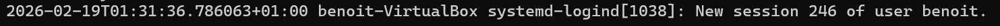

---

## 14. HTTPS avec certificat auto-signé

### 14.1 Génération du certificat

```bash
sudo mkdir -p /etc/nginx/ssl
cd /etc/nginx/ssl
sudo openssl req -x509 -nodes -days 365 -newkey rsa:2048 \
    -keyout site-tp.key -out site-tp.crt
```

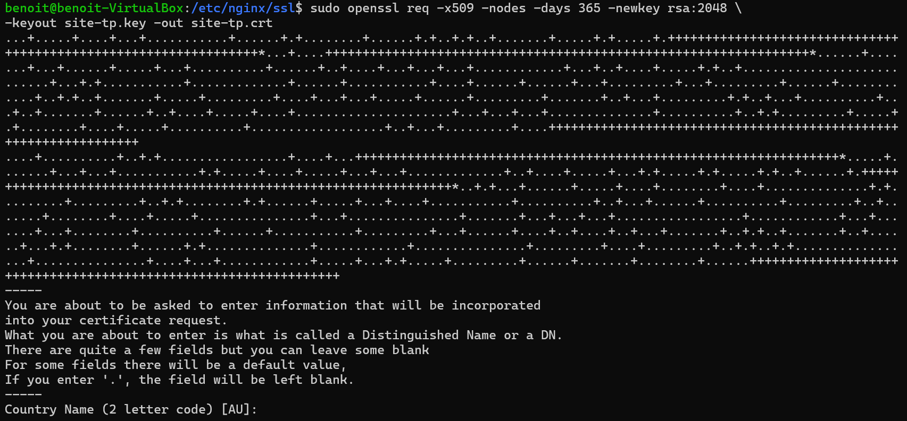
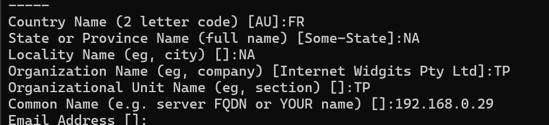
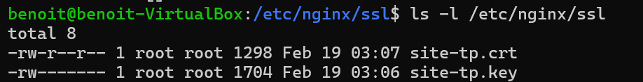

### 14.2 Configuration Nginx pour HTTPS

Modifier `/etc/nginx/sites-available/site-tp` :

```nginx
server {
    listen 443 ssl;
    server_name localhost;

    ssl_certificate /etc/nginx/ssl/site-tp.crt;
    ssl_certificate_key /etc/nginx/ssl/site-tp.key;

    root /var/www/site-tp;
    index index.html;
}

server {
    listen 80;
    server_name localhost;
    return 301 https://$host$request_uri;
}
```

Tester et redémarrer :

```bash
sudo nginx -t
sudo systemctl restart nginx
```

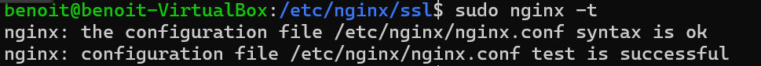

### 14.3 Test HTTPS

```bash
curl -k https://<IP_VM>
```

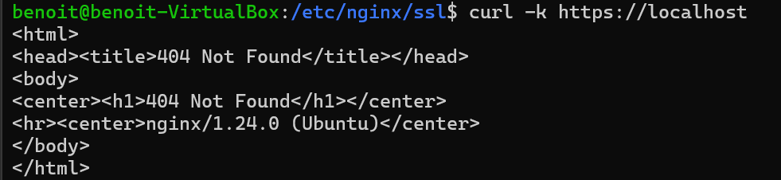  <!-- réponse nginx, la page test se trouve ailleurs -->

Vérifier la redirection HTTP :

```bash
curl -I http://<IP_VM>
```

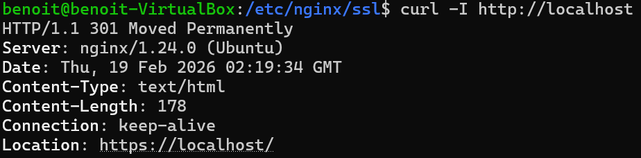

---

## 15. Firewall et sécurité

```bash
sudo ufw allow 'Nginx Full'
sudo ufw allow 2222
sudo ufw status
```

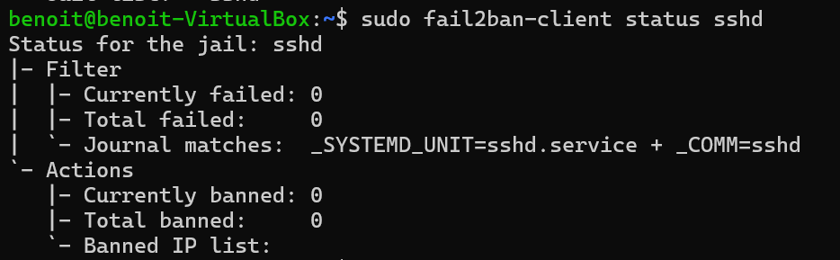

On voit l’ouverture du port SSH personnalisé :\
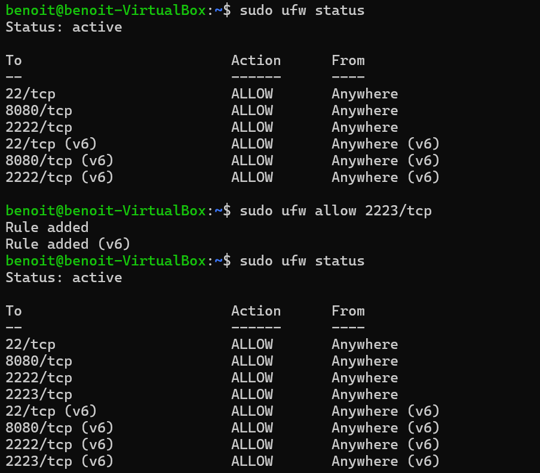

Définir permissions du site :

```bash
sudo chown -R www-data:www-data /var/www/site-tp
sudo chmod -R 755 /var/www/site-tp
```

---

## 16. Résultat attendu

- Nginx accessible en HTTP et HTTPS
- Redirection automatique HTTP → HTTPS
- Certificat auto-signé fonctionnel
- Firewall configuré
- Page test accessible depuis le client

---

### Annexe : autres captures

Les images suivantes n'ont pas été insérées dans le rapport principal mais
peuvent servir de support ou de vérification ultérieure :

```
img6.png  img7.png  img8.png  img9.png  img10.png img12.png img14.png
img18.png img19.png img20.png img23.png img25.png img26.png img27.png
img28.png img31.png img32.png img34.png img36.png img41.png img42.png
img46.png img49.png img50.png img51.png img52.png img53.png img55.png
img56.png img57.png img58.png
```

(la numérotation est celle du répertoire `imageTP4`)

