# TP5 – pfSense – Bases d’un pare-feu

Ce fichier reprend le déroulé du TP avec les questions extraites de `subject.md`
et les réponses accompagnées des captures d’écran.

---

## Partie 1 – Prise en main et sécurisation

### 1. Accès à l’interface

Connectez‑vous à l’interface web de pfSense.

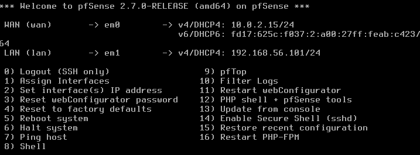

**Questions**

- **Quelle est l’adresse IP du LAN ?**  
  192.168.168.56.101

- **Quelle est l’adresse IP du WAN ?**  
  10.0.2.15

- **Pourquoi utilise‑t‑on HTTPS ?**  
  Parce que le protocole chiffre les échanges et protège
  les identifiants/paramètres contre l’interception.

- **Pourquoi faut‑il changer les identifiants par défaut sur un pare‑feu ?**  
  Les identifiants par défaut sont publics ; il est donc essentiel
  de les remplacer pour empêcher un accès non autorisé.

### 2. Sécurisation de l’accès administrateur

Modifiez les paramètres du compte administrateur.

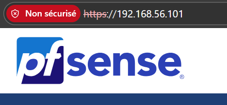

**Questions**

- **Où se gèrent les utilisateurs ?**  
  Dans *System > User Manager*.

- **Qu’est‑ce qu’un mot de passe robuste ?**  
  Un mot de passe long (>12 caractères), incluant majuscules,
  minuscules, chiffres et caractères spéciaux, unique et imprévisible.

- **Pourquoi sécuriser en priorité l’accès admin sur un équipement réseau ?**  
  Le compte admin contrôle toute la configuration ; un accès compromis
  permettrait de modifier l’ensemble du pare‑feu.

---

## Partie 2 – Comprendre les interfaces réseau

### 3. Vérification des interfaces

Vérifiez l’affectation WAN / LAN.

**Questions**

- **Quelle interface permet l’accès Internet ?**  
  WAN

- **Quelle interface correspond au réseau interne ?**  
  LAN

- **Que se passerait‑il si les interfaces étaient inversées ?**  
  L’interface interne ne pourrait plus joindre Internet et la gestion 
  serait perturbée ; la topologie serait incorrecte.

---

## Partie 3 – Configuration des services réseau

### 4. DHCP

Configurez le serveur DHCP pour le réseau LAN.

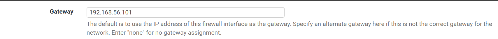

**Questions**

- **Pourquoi utiliser DHCP plutôt qu’une IP fixe ?**  
  Pour éviter les conflits d’adresses et simplifier l’administration.

- **Quelle plage d’adresses choisir ?**  
  192.168.56.50 – 192.168.56.200

- **Quelles adresses faut‑il éviter d’inclure dans la plage ?**  
  L’adresse réseau (…0), la broadcast (…255) et l’adresse de la passerelle
  (…1 ou …254 selon configuration).

**Vérification**

Ubuntu obtient‑elle automatiquement une adresse IP ?  
Oui.  
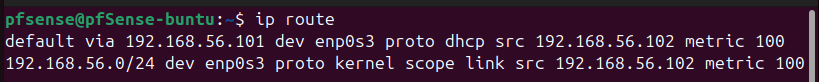

### 5. DNS

Activez et configurez le résolveur DNS.

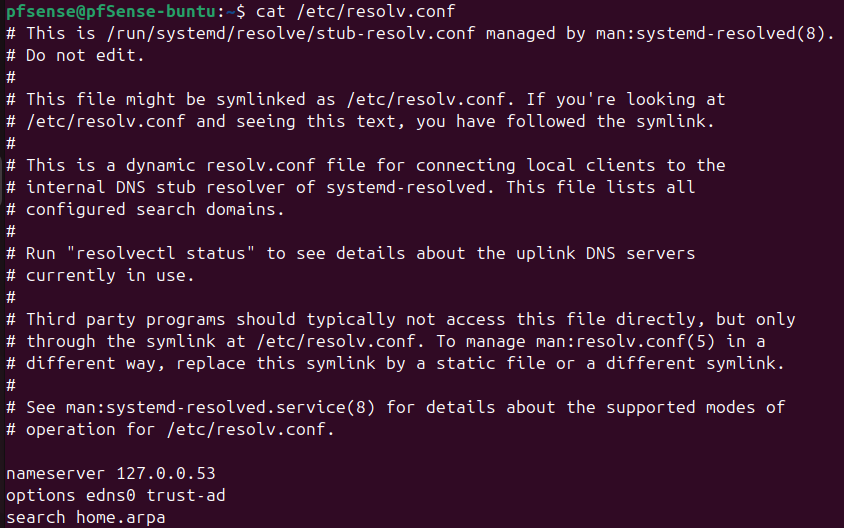
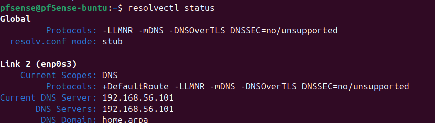

**Questions**

- **Pourquoi un pare‑feu peut‑il jouer le rôle de serveur DNS ?**  
  Centralisation des requêtes, mise en cache, filtrage et sécurité.

- **Que se passe‑t‑il si le DNS ne fonctionne pas mais que le ping vers 8.8.8.8 fonctionne ?**  
  Le routage est opérationnel mais la résolution des noms échoue.

---

## Partie 4 – Autoriser l’accès Internet

### 6. Règles de pare‑feu

Configurez les règles nécessaires pour permettre aux machines du LAN
 d’accéder à Internet. (pfSense applique les règles de haut en bas.)

**Questions**

- **Quelle doit être la source ?**  
  `LAN net` – le trafic part du réseau interne.

- **Quelle doit être la destination ?**  
  `any` – les clients doivent pouvoir joindre n’importe quelle adresse.

- **Faut‑il autoriser tous les protocoles ?**  
  En laboratoire, on peut; en production, limiter aux protocoles utiles
  (TCP 80, TCP 443, UDP 53, ICMP si besoin).

**Tests**

- Ping vers pfSense  
- Ping vers 8.8.8.8  
- Test DNS  
- Accès web  

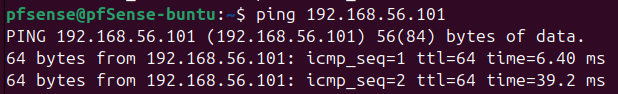
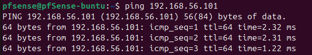
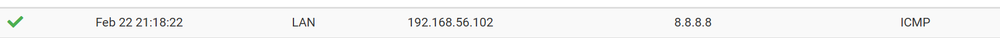

### 7. NAT

Vérifiez la configuration du NAT sortant.

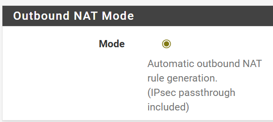
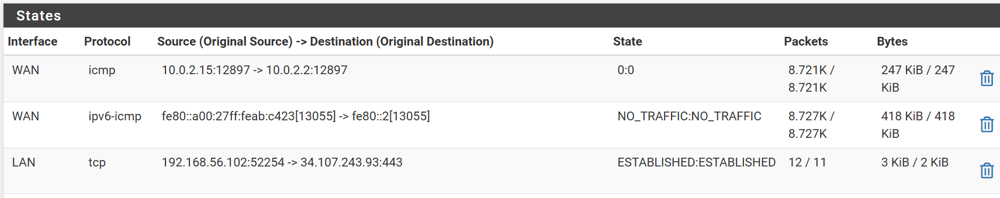

**Questions**

- **Pourquoi le NAT est‑il nécessaire avec une interface WAN en NAT ?**  
  Les adresses privées ne sont pas routables : NAT permet de masquer
  plusieurs IP derrière l’IP publique.

- **Quelle est la différence entre NAT automatique et manuel ?**  
  Automatique : pfSense génère les règles.  
  Manuel : l’administrateur configure chaque traduction (utile pour
  règles spécifiques).

- **Comment vérifier qu’une traduction d’adresse a lieu ?**  
  Dans *Diagnostics > States*, on voit une entrée montrant
  192.168.56.102 → 10.0.2.15.

---

## Partie 5 – Filtrage

### 8. Blocage d’un site spécifique

Bloquez l’accès à un site web de votre choix.

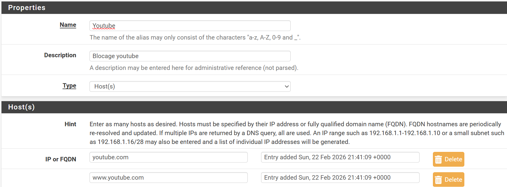
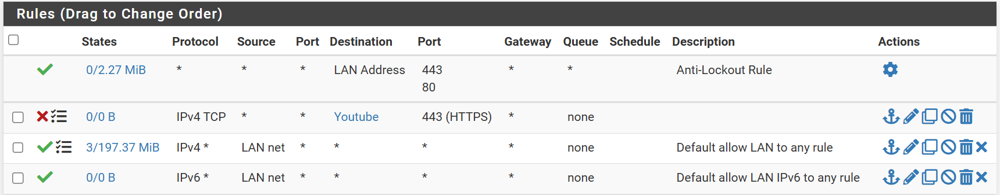

**Questions**

- **Faut‑il bloquer par IP ou par nom de domaine ?**  
  Par nom de domaine (FQDN) : les IP changent, les CDN multiplient les
  adresses.

- **Que se passe‑t‑il si le site utilise HTTPS ?**  
  Le trafic est chiffré ; pfSense ne voit que l’IP et le port 443,
  il ne peut pas inspecter le contenu.

- **Pourquoi le blocage par IP peut‑il être contourné ?**  
  IP multiples, changements dynamiques, VPN, IPv6, etc.

**Logs**

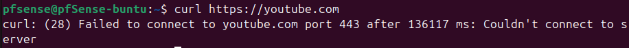
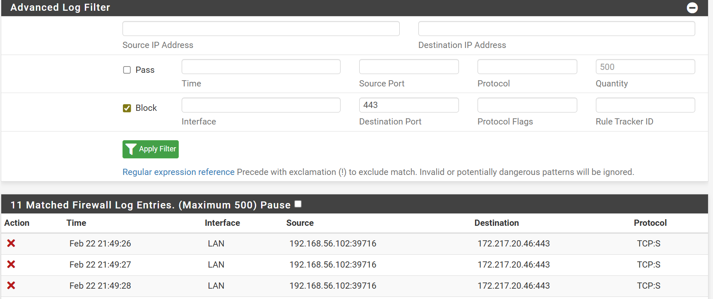

### 9. Blocage d’une catégorie de sites (jeux d’argent)

Créez une solution propre et maintenable pour bloquer plusieurs sites
 en utilisant des alias.

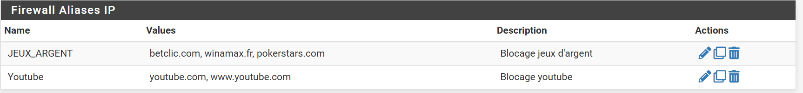
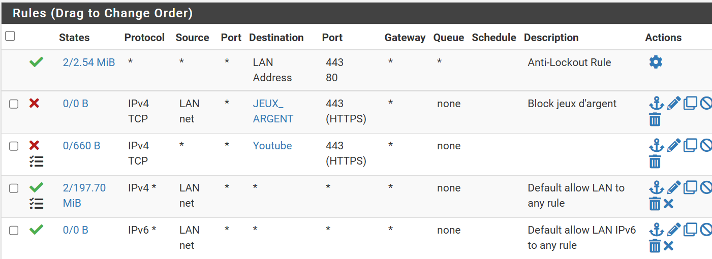
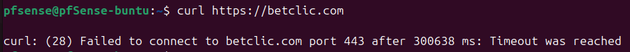
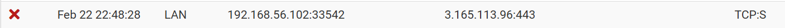

**Questions**

- **Pourquoi ne pas créer une règle par site ?**  
  Cela devient ingérable ; un alias regroupe plusieurs destinations sous
  une seule règle.

- **Où se créent les alias ?**  
  Dans *Firewall > Aliases*.

- **Comment vérifier qu’une règle bloque réellement le trafic ?**  
  Consulter *Status > System Logs > Firewall* ; l’entrée doit
  indiquer `Block` pour la règle et les adresses concernées.

---

## Partie 6 – Aller plus loin (partie plus tendue)

### 10. Blocage par catégorie (réseaux sociaux)

Créez un alias puis appliquez une règle de blocage.

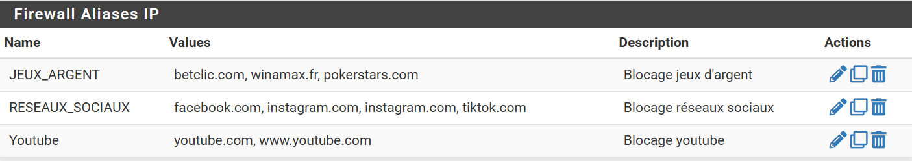
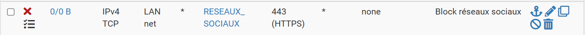
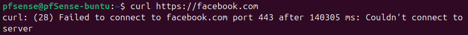
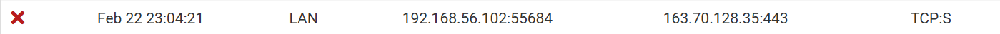

**Question**

- **Que se passe‑t‑il si la règle est placée sous une règle "Pass Any" ?**  
  Elle n’est jamais exécutée : pfSense applique la première règle
  correspondante.

### 11. Règles horaires

Créez un horaire et appliquez‑le à une règle existante.

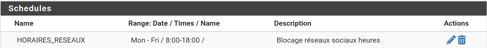
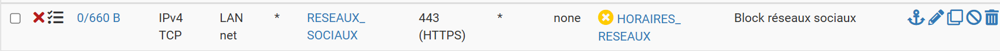

**Questions**

- **Pourquoi les règles horaires sont‑elles utiles en entreprise ?**  
  Elles permettent d’activer/désactiver automatiquement des restrictions
  selon les heures de travail (réseaux sociaux, streaming, etc.).

### 12. Serveur web local

Installez un serveur web sur Ubuntu et configurez des règles d’accès.

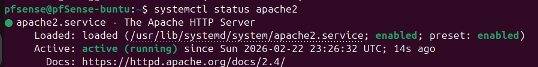
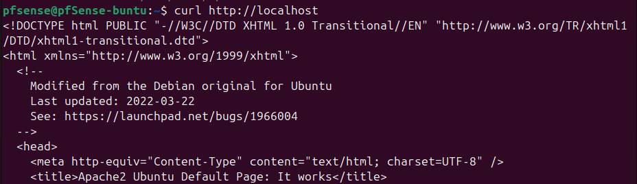
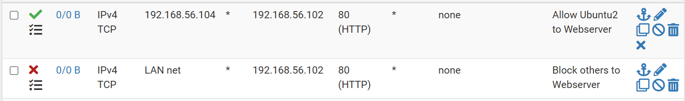

**Questions**

- **Filtrer par IP source ?**  
  Oui – cela restreint l’accès à une machine précise.

- **Filtrer par port ?**  
  Oui – on autorise seulement le port 80 (service HTTP).

- **Pourquoi le pare‑feu protège‑t‑il le LAN même en réseau interne ?**  
  Tout le trafic traverse l’interface LAN de pfSense, qui applique
  les règles, y compris pour les communications internes.

### 13. Logs et analyse

Activez la journalisation sur certaines règles.

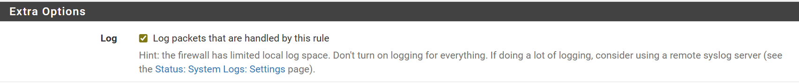

**Questions**

- **Différence entre paquet bloqué et autorisé ?**  
  *Pass* laisse passer, *Block* rejette. Les logs indiquent l’action.

- **Identifier quelle règle a déclenché le blocage ?**  
  Le log contient l’ID de la règle, que l’on retrouve dans *Firewall > Rules*.

- **Comprendre le sens du trafic ?**  
  La source est l’émetteur, la destination le récepteur. Les ports
  montrent le service visé.

### 15. Filtrage MAC

Testez le filtrage par adresse MAC.

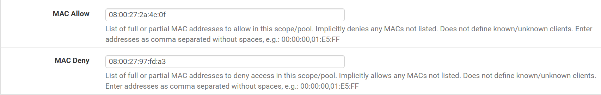
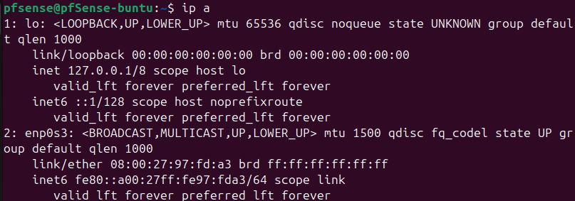

**Questions**

- **Le filtrage MAC est‑il réellement sécurisé ?**  
  Non, c’est facilement contournable.

- **Pourquoi est‑il facilement contournable ?**  
  On peut modifier l’adresse MAC d’une carte réseau (spoofing) et
  observer le réseau pour en connaître une autorisée.

### 16. Portail captif

Implémentez un portail captif.

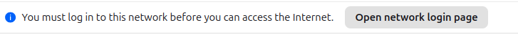

**Questions**

- **Dans quels contextes utilise‑t‑on cela ?**  
  Hôtels, aéroports, universités, Wi‑Fi publics… pour contrôler
  l’accès.

- **Quels avantages par rapport à une simple règle de pare‑feu ?**  
  Le portail permet d’authentifier et d’identifier les utilisateurs,
  appliquer des restrictions utilisateur, etc.

### 17. Sauvegarde / restauration

Sauvegardez puis restaurez la configuration.

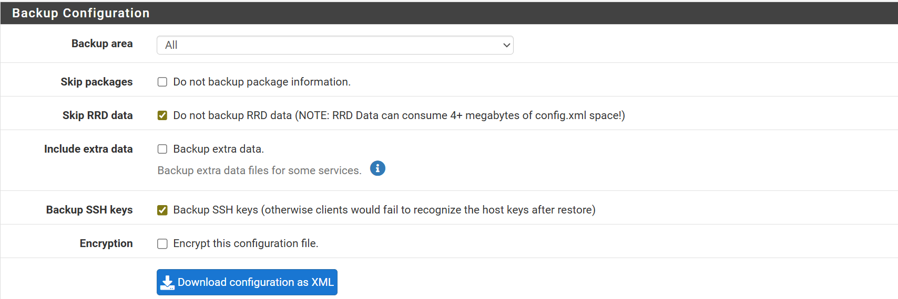
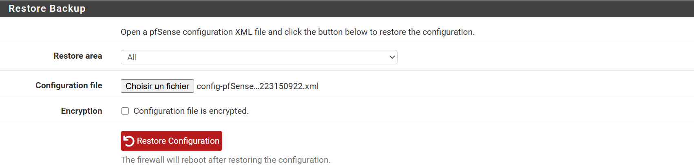

**Question**

- **Pourquoi la sauvegarde régulière est‑elle essentielle en production ?**  
  Elle permet de récupérer d’une erreur ou d’un incident
  rapidement et d’éviter des interruptions prolongées.

---

