# TP6 — Mise en place d'un serveur OpenVPN sur Ubuntu Server

## Objectifs

À l’issue de ce TP, vous devrez être capables de :

- Installer et configurer OpenVPN sur Ubuntu Server
- Mettre en place une infrastructure de certificats (PKI)
- Comprendre le rôle du NAT et du routage IP
- Générer un profil client fonctionnel
- Diagnostiquer un service système en échec

## Mise en place

Vous devez mettre en place :

- Une VM Ubuntu Server LTS
- Un réseau NAT
- Une connexion SSH vers la VM

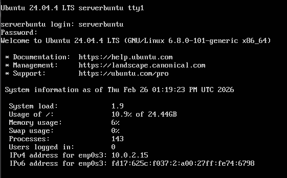

## Préparation du système

- Mettre à jour le système
- Installer les paquets nécessaires : `openvpn` et `easy-rsa`

---

## Partie 1 — Comprendre la PKI

### Questions

**À quoi sert une autorité de certification (CA) ?**  
Une autorité de certification est une entité de confiance qui valide une identité et signe des certificats pour permettre des échanges sécurisés.

**Quelle différence entre clé privée et certificat ?**  
La clé privée est secrète et sert à signer/déchiffrer. Le certificat contient la clé publique et l’identité validée par la CA.

**Pourquoi un serveur VPN a-t-il besoin de certificats ?**  
Pour authentifier le serveur et les clients, chiffrer les échanges, et empêcher les connexions non autorisées.

### Création de l’infrastructure Easy-RSA

#### 1) Créer un environnement PKI

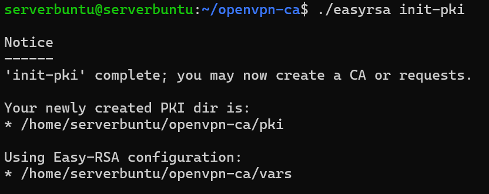

#### 2) Générer une CA

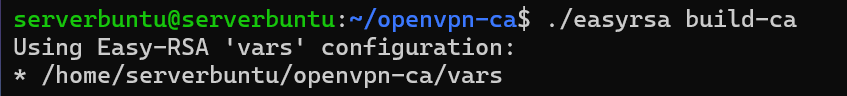

#### 3) Générer un certificat serveur

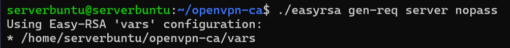
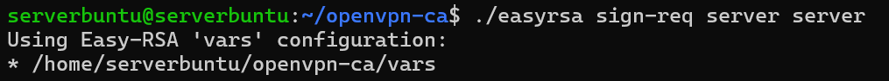

#### 4) Générer un certificat client

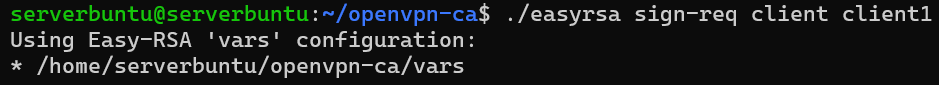

#### 5) Générer les paramètres Diffie-Hellman

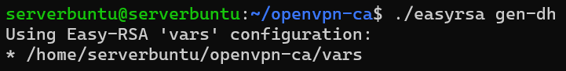

#### 6) Générer une clé TLS supplémentaire

### Questions

**Où Easy-RSA crée ses fichiers ?**  
Dans le dossier `~/openvpn-ca/pki/`.

**Que contient le dossier `pki/` ?**

- `ca.crt` : certificat de la CA
- `private/` : clés privées
- `issued/` : certificats signés
- `reqs/` : demandes de signature (CSR)
- `dh.pem` : paramètres Diffie-Hellman

**Différence entre `gen-req` et `sign-req` ?**

| Commande | Rôle |
|---|---|
| `gen-req` | Crée la clé privée + la demande de certificat |
| `sign-req` | Signe la demande avec la CA pour rendre le certificat valide |

**Que se passe-t-il si on oublie de signer ?**  
Le certificat n’est pas valide, donc la connexion VPN est refusée.

---

## Partie 2 — Configuration du serveur OpenVPN

Créer le fichier de configuration serveur :  
`/etc/openvpn/server/server.conf`

### Éléments attendus

- Port d’écoute
- Protocole

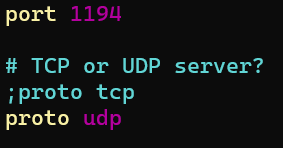

- Interface virtuelle

- Réseau attribué aux clients

- Références aux certificats

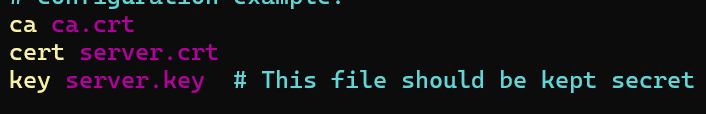

### Questions

**Que signifie `dev tun` ?**  
`tun` crée une interface tunnel IP (couche 3).

**Différence UDP vs TCP pour un VPN ?**  
UDP est plus rapide (moins d’overhead), TCP est plus fiable mais peut entraîner une double gestion de retransmission.

**Quelle plage IP choisir pour le VPN ? Pourquoi ?**  
Exemple : `10.8.0.0/24`.

- C’est un réseau privé (RFC1918)
- Il doit être différent du LAN local
- Cela évite les conflits de routage

### Routage et NAT

#### Activer le forwarding IP

#### Mettre en place une règle NAT pour l’accès Internet depuis le VPN

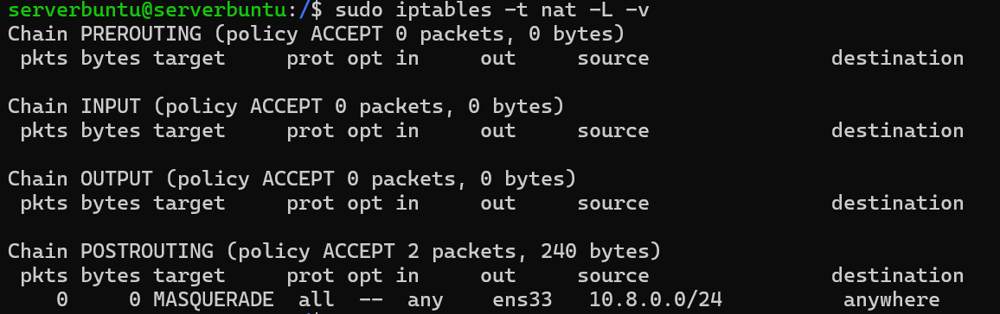

### Questions

**Où se configure `ip_forward` ?**  
Dans `/etc/sysctl.conf`.

**Quelle commande affiche les règles NAT actuelles ?**  
`sudo iptables -t nat -L -v`

**Pourquoi faut-il masquerader le réseau VPN ?**

- Le réseau VPN (`10.8.0.0/24`) est privé
- Internet ne route pas ces adresses privées
- Le serveur traduit l’IP source VPN en IP publique
- Sans NAT, pas d’accès Internet pour les clients VPN

### Démarrage et analyse du service

- Démarrer le service OpenVPN
- Vérifier son état

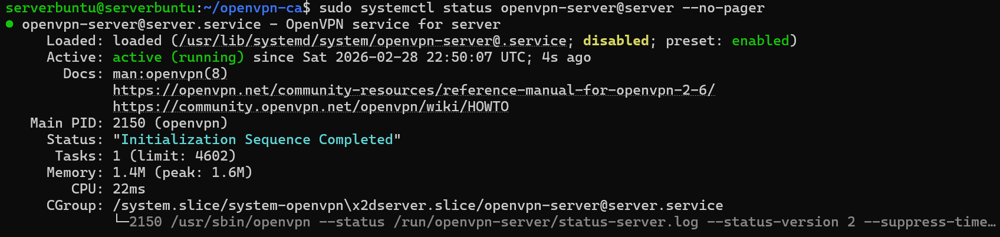

Si le service échoue :

**Quelle commande permet d’afficher les logs système d’un service ?**  
`sudo journalctl -xeu openvpn-server@server`

**Différence entre `status` et `journalctl` ?**  
`status` donne un résumé de l’état courant ; `journalctl` affiche les logs détaillés et l’historique.

---

## Partie 3 — Création du profil client

Créer un fichier `.ovpn` fonctionnel.

### Éléments à inclure

- Adresse publique du serveur
- Certificat CA
- Certificat client
- Clé privée client
- Paramètres de chiffrement
- Authentification TLS

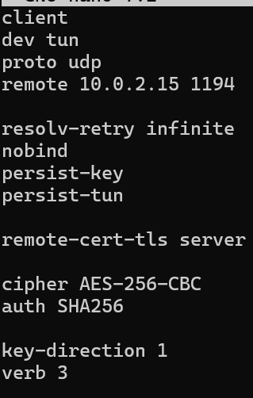
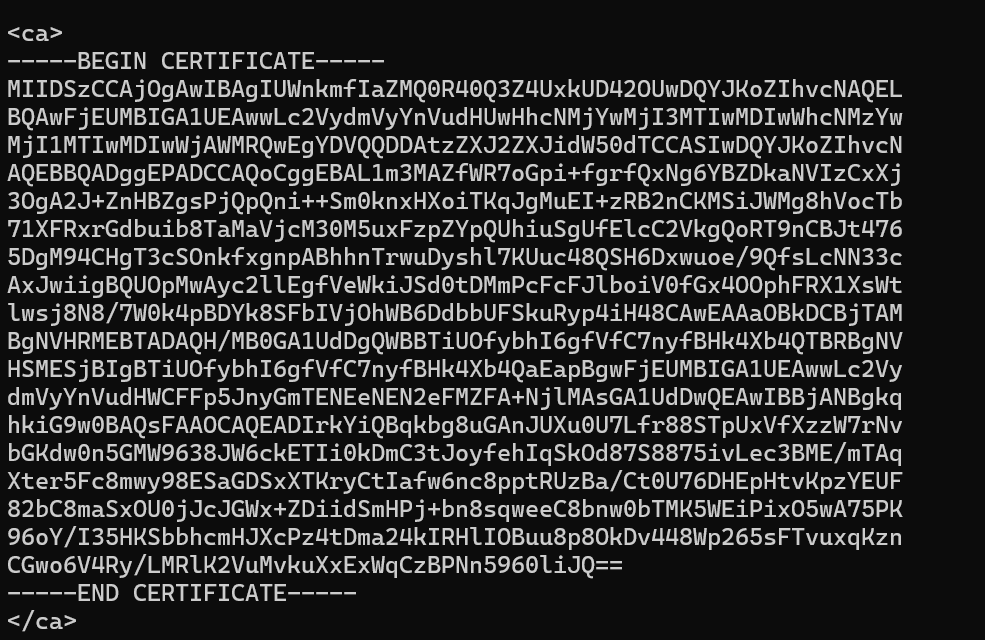
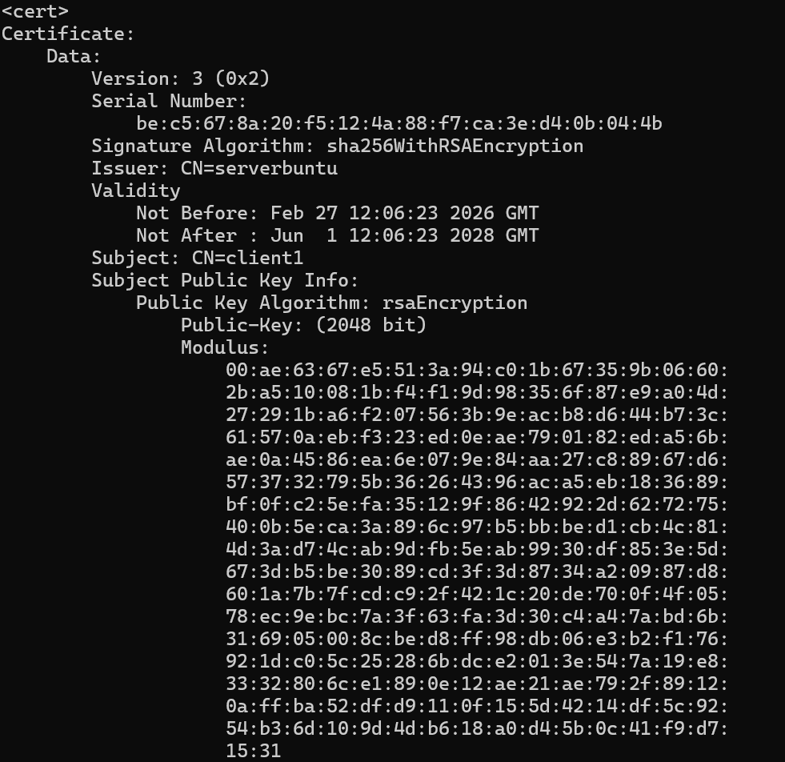

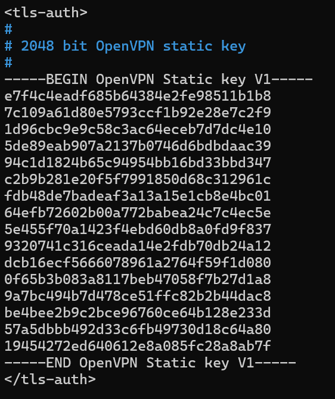

### Questions

**Comment intégrer un certificat directement dans un fichier `.ovpn` ?**  
En l’intégrant entre balises, par exemple : `<ca> ... </ca>` (même principe pour `<cert>` et `<key>`).

**Pourquoi la clé privée ne doit-elle jamais être partagée publiquement ?**

- Elle permettrait d’usurper l’identité du client
- Un tiers pourrait se connecter au VPN à sa place

### Tests et validation

**Comment vérifier que le trafic passe par le VPN ?**  
Avec `ip route` : la route par défaut doit passer par `tun0`.

**Que se passe-t-il si le port 1194 est bloqué ?**

- Échec de connexion (timeout côté client)
- Solutions : ouvrir le firewall ou utiliser TCP/443